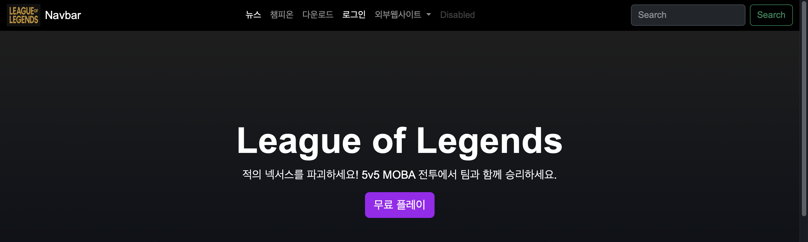
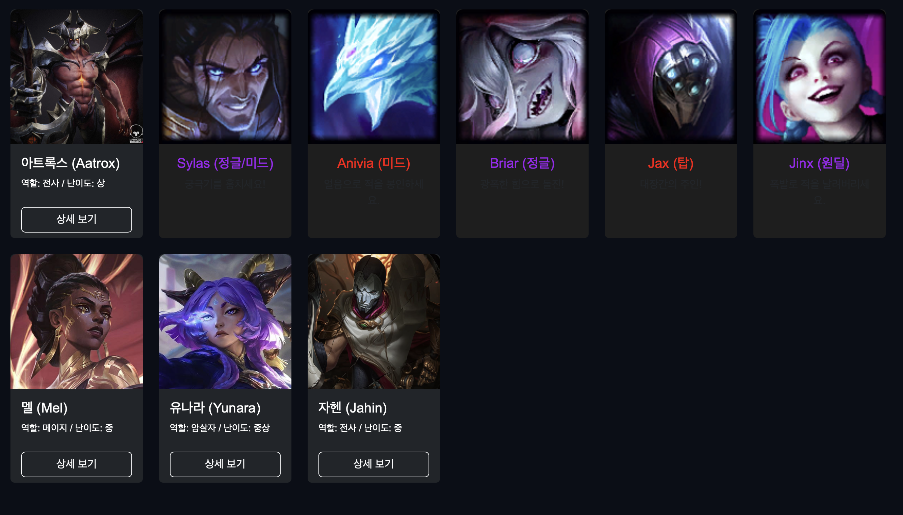
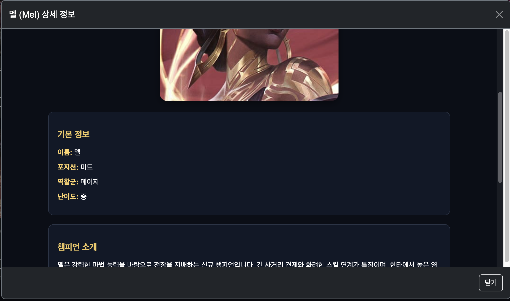
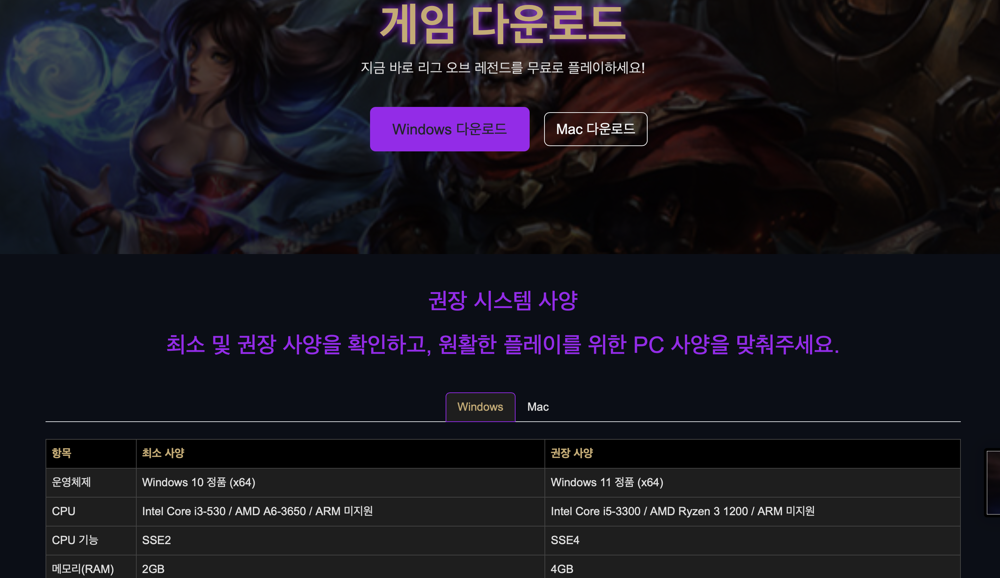
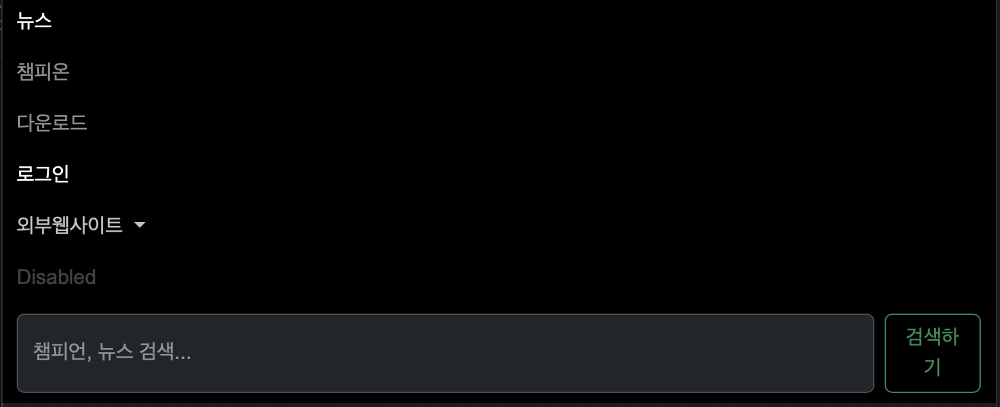
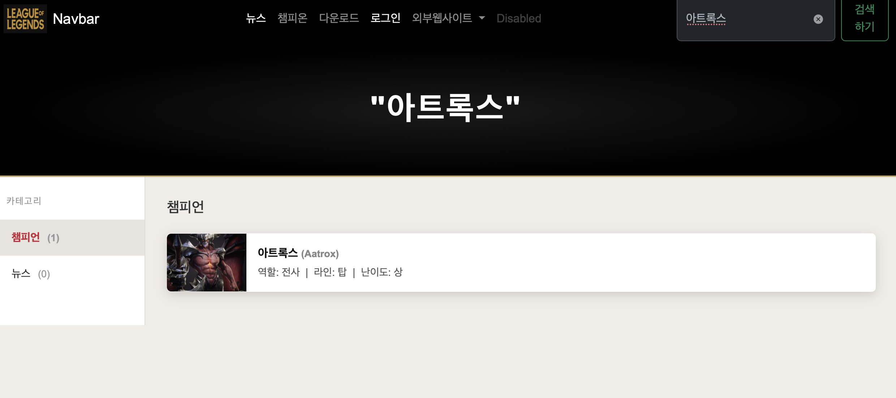
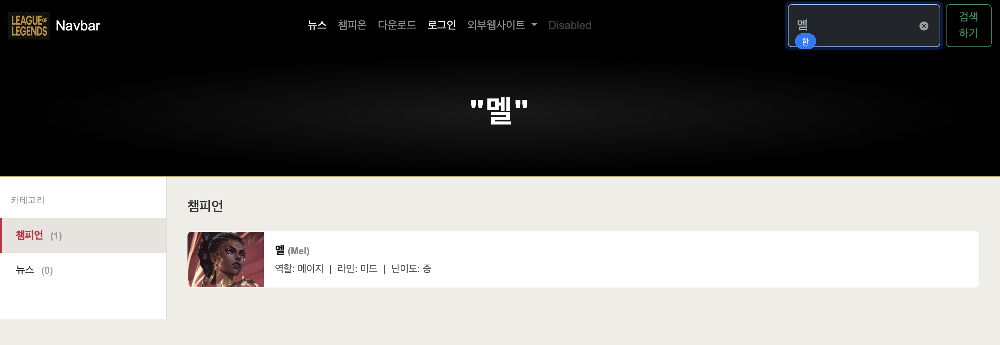

# code-with-quarkus

This project uses Quarkus, the Supersonic Subatomic Java Framework.

If you want to learn more about Quarkus, please visit its website: <https://quarkus.io/>.

## Running the application in dev mode

You can run your application in dev mode that enables live coding using:

```shell script
./mvnw quarkus:dev
```
# quarkus 프로젝트 시작! (학번 : 20230989 이름 : 박서연 )
매 주 수업 내용을 정리하자.

## 2주차 수업 내용
실습 1 : 쿼크스 환경 구축 및 준비 완료!<br>
실습 2 : HTML 기본 및 LOL 메인 화면 개발 완료!


## 3,4주차 수업 및 과제
실습 1 : HTML/CSS 기본, 심화 개발 완료!<br>

과제 :

1. 네비게이션 바 개선
   - 네비바 앞에 로고 삽입
   - 네비바 메뉴 가운데 정렬
   - UL 목록 속성 수정 : `me-auto` 부분을 `mx-auto`로 변경하여 네비바 가운데 정렬 구현

2. 챔피온 카드 구성
   - 기존 챔피온 카드 div 내부 글자 및 구성 수정
   - 카드별 정보를 보다 보기 쉽게 정리

3. 모달 상세 정보 구현
   - `modals` 폴더 안에 각 챔피온별 `.html` 파일 생성
   - iframe을 활용하여 상세 정보가 모달창에 출력되도록 구현

<div align="center">
    
    
    
</div>

## 5주차 수업 및 과제
실습 :  ppt_4주차 진도 완료!
<div align="center">
    
</div>

## 6주차 수업
실습 : ppt_6주차 : 실시간 챔피언 검색하기 - 1 완료!
<div align="center">
    
</div>

## 7주차 수업 및 과제
실습 : ppt_6주차 : 실시간 챔피온 검색하기 - 2 완료!<br>

과제 :

1. 추가 구현하기

   - 데이터 정의 추가
     - 개인적으로 새로운 챔피온 데이터를 3개 이상 추가
     - 검색어 창에 키워드로 이름 입력
     - 정상적으로 검색 및 화면 출력되도록 구현

   - 검색어 기능 추가
     - 검색어가 없거나 공백인 경우 메인 화면으로 돌아가기
     - `showMainScreen()` 함수 구현
     - `performSearch()`에서 검색어(q)가 없을 경우 호출하도록 조건 추가
     - 클릭 시 기존 section 및 메인 화면이 다시 보이도록 처리

<div align="center">
    
    
</div>